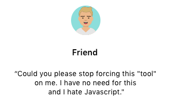

# Wasted Time ⏳ 🤷 ⌛️

A tool for the **reclusive introvert**, the **productivity zealot**, the **time police officer**, or just the person who wants to quantify information about how his/her time is generally spent.

## Brief Description...

**Do you relate to one or more of the following scenarios...**

* 👉 Do you keep telling yourself:
  > *"Geez, I spend too much time in meetings I can't get anything done ?"*

* 👉 Does your **project owner**, **scrum master**, **spouse/ significant other** is always telling you 🗣
  > *"We need to talk..."*

  or

  > *"We need to have a meeting?"*

* 👉 Does your time ⏰ seems to fly 🐦 out of your hands 👐 because you're always on "meetings" ?
* 👉 Do you feel like you cannot 💩 🚽 in peace cause you are always taking care of some other stuff ?
* 👉 Have you actually ever wanted to know 🤔 how much of your time is spend on "meetings" 💼 versus all the other important stuff you pretend to be doing ?

If your answer is **"YES"** to any of these questions then this simple cli if for you 🙋🙋‍. 

This little tool will tell you what's the percentage of time spent on unnecessary stuff versus actually doing what really matters.

## Some More Text...

Next time your **significant other** 💏 , **gardener** 👨‍🌾, **dog** 🐶, **friend** 👫, **manager** 👨‍💼 💼, **family member** 👶 wants to take you away from the actual "**important stuff**" you think you are doing. Just run this and say:

* 🙅‍ *"No hon, 15% of our available time was spent on having sex last week. No more coitus until at least next week."*

* ⛔ *"No man, I cannot hang out with you tonight, cause I have allocated more than 70% of my time just "hanging out" with you."*

* 🙉 *"Geez buddy!!, I would like to play with you tonight (masturbate tonight), but it seems that I have given you 80% of my time this week. Maybe on saturday?"*

Now you can go and feel entitled to go and do what REALLY MATTERS in your life.

## How To Use

You want this globally I guess ?

Install from `npm` or  `yarn`

* `npm install wastedtime -g` or 
* `yarn global add wastedtime --prefix /usr/local/`

Run by calling the `wastedtime`

## What People Are Saying (Testimonials)

 

 

 

 

## Contribute

You can contribute by opening an `ISSUE` on github, or just simply by submitting a PR.

## License

[License]('.LICENSE')

## Disclaimer

All **opinions**, **ideas**, **text**, **commas**, **letters**, **periods**, **breaths** are my own. Names, places, professions, animals, people, objects are products of my imagination.

* No animals were harm by the creation of this tool.
* No relationships were *majorly* broken by the used of this cli.

---

Brought to you with ♥ by D/S  &copy; 2019.
